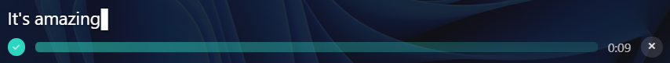
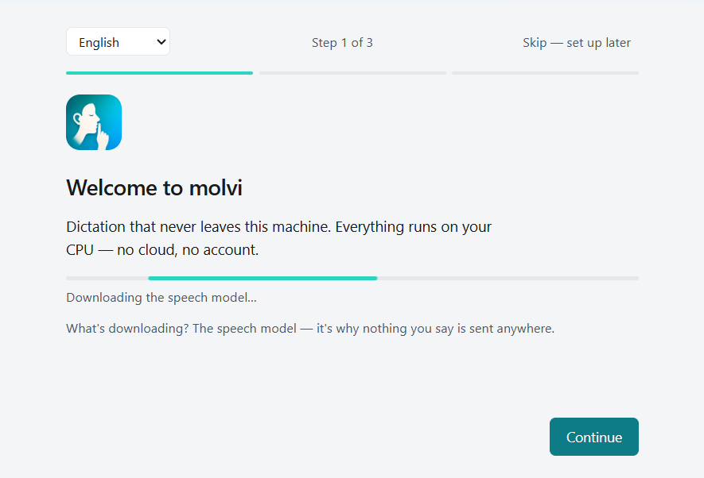
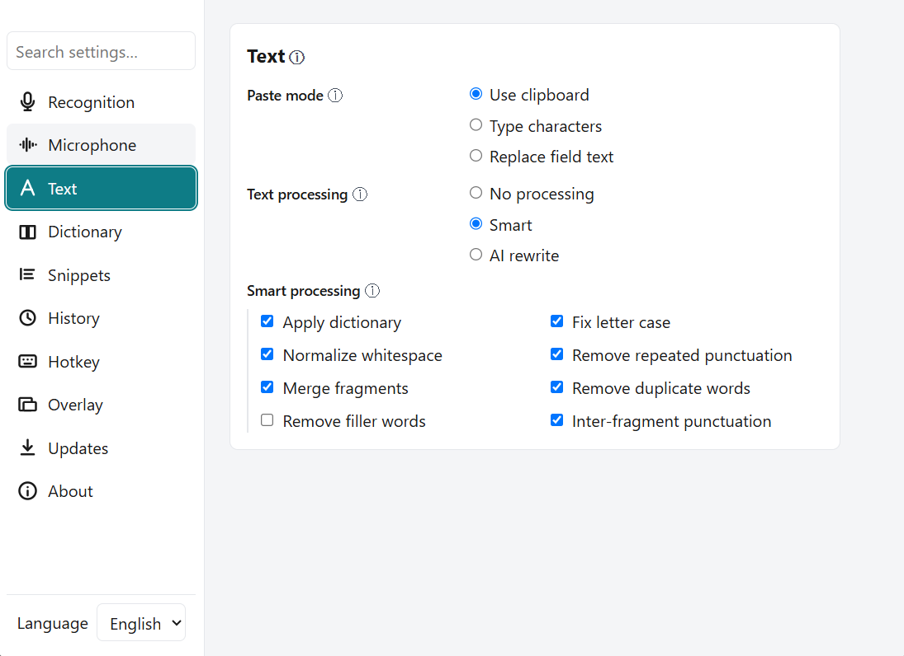

<p align="center">
  
</p>

<h1 align="center">MOLVI</h1>

<p align="center">
  <strong>Free, private, offline dictation — with a 36-language UI and a dedicated Russian engine.</strong><br/>
  For Windows, macOS, and Linux.
</p>

<p align="center">
  <a href="https://github.com/bumbaRasch/molvi/actions/workflows/ci.yml"></a>
  <a href="#license"></a>
  <a href="https://github.com/bumbaRasch/molvi/releases"></a>
  
  <a href="https://tauri.app"></a>
</p>

<p align="center">
  
</p>

---

**MOLVI** is a push-to-talk dictation app: it transcribes your speech on your own
CPU and pastes the text wherever your cursor is — any field, any window. No cloud,
no account, no subscription.

The interface is translated into **36 languages** — including Arabic and Hebrew
(right-to-left). We're not aware of another dictation app that ships a localized
UI; the rest are English-only.

It ships two offline engines:

- **Nemotron 3.5 ASR** (default) — multilingual, **40+ languages**, streamed live as
  you speak.
- **GigaAM-v3** — a dedicated **Russian** model: fast and natively punctuated. Most
  other tools handle Russian through a multilingual model rather than a native one.

---

## Table of contents

- [Why MOLVI?](#why-molvi)
- [Features](#features)
- [Privacy](#privacy)
- [Performance](#performance)
- [Install](#install)
- [Quick start](#quick-start)
- [How it works](#how-it-works)
- [Comparison](#comparison)
- [Known limitations](#known-limitations)
- [Roadmap](#roadmap)
- [Contributing](#contributing)
- [Acknowledgements](#acknowledgements)
- [License](#license)

## Why MOLVI?

Most dictation tools force a trade: accurate-but-cloud-and-paid (superwhisper, Wispr
Flow), or private-but-bare-bones. MOLVI refuses it.

- **Free, forever.** No account, no subscription, no feature gate. Licensed under
  MIT OR Apache-2.0.
- **Private by design, not by promise.** Recognition runs 100% on your CPU. Your voice
  never leaves your computer — and that claim is [enforced by a test suite](#privacy),
  not a marketing sentence.
- **A real Russian engine.** GigaAM-v3 is Russian-native and punctuated, not a
  multilingual afterthought.
- **Speaks your language.** A 36-language UI with full RTL — the only dictation app
  localized past English.
- **One app, three desktop OSes.** The same Rust/Tauri build runs on Windows 11,
  macOS (Apple Silicon), and Linux.

## Features

**Recognition**
- Two offline engines: GigaAM-v3 (Russian, punctuated) and Nemotron 3.5 (40+ languages, default).
- Live partial transcript — words appear as you speak, not only after you release.
- Voice Activity Detection with automatic silence stop.
- Push-to-talk (hold) and toggle modes. Configurable global hotkey.

**Private by design**
- 100% on-device recognition. Zero network requests while dictating.
- No telemetry, no analytics, no crash-report upload.
- Logs are metadata-only — transcript text, audio, dictionary, history, and snippets
  are never logged. [Enforced by tests](#privacy).
- Local, searchable history (opt-in) stored in SQLite — with one-click erase.

**Workflow**
- Pastes into any app, anywhere your cursor is.
- Custom **dictionary** (CSV/JSON import/export) and **snippets** (voice → text blocks).
- **Command mode** — say a phrase, trigger a keyboard action (undo, copy, paste, new
  line, select-all, …). 10 actions across 5 languages.
- **Per-app profiles** — different post-processing per foreground application.
- Three post-processing tiers: **Raw**, **Smart** (deterministic clean-up, offline),
  **Polished** (bring-your-own LLM endpoint for heavy clean-up).
- Smart clean-up includes offline self-correction: *"send it Monday… no wait Tuesday"*
  → *"Tuesday"*.

**Everywhere**
- Windows 11, macOS (Apple Silicon), Linux.
- 36-language UI + RTL (Arabic, Hebrew).
- Auto-updater (ed25519-signed updates via GitHub Releases).

## Privacy

**Private by design, not by promise.**

- **All processing happens on your device.** Speech recognition and text clean-up run
  entirely on your CPU — the recognition engine makes zero network requests. The only
  outbound calls MOLVI ever makes are the optional update check (a `latest.json` fetch
  from GitHub — turn it off in settings), a one-time model download from Hugging Face
  on first run, and — only if you enable **Polished** mode — your transcript sent to
  *your* configured LLM endpoint. Recognition itself never touches the network.
- **No telemetry, no analytics, no crash-report upload.** None.
- **Logs carry metadata only** — timing, language code, foreground app basename.
  Transcript text, audio samples, dictionary entries, history rows, and snippet
  content are never logged, not even at trace level. This is enforced by
  [`src-tauri/tests/log_privacy.rs`](src-tauri/tests/log_privacy.rs) — 6 always-on
  privacy-substrate tests (+ 2 model-gated) that fail if any private content reaches
  a log call. Almost no app in this category can point you to a privacy *test suite*.
- **Your data stays local.** History, dictionary, and snippets live in a SQLite file
  under your appdata directory. Audio is never written to disk. Models cache to
  `%APPDATA%\com.molvi.app\models\` and download once over HTTPS from Hugging Face —
  no audio is ever uploaded.

**Verify it yourself.** Block MOLVI in your OS firewall and dictate: recognition still
works, proving nothing left the machine. Or watch your network monitor during a
session — it stays silent.

## Performance

MOLVI is fast on a plain CPU — no GPU required.

> Indicative. RTF = audio-seconds processed per wall-second. A single number is never
> the whole story — results vary with utterance length, language, and hardware; longer
> utterances amortize fixed per-session overhead.

| Engine | Language | RTF | Release → text pasted |
|---|---|---|---|
| GigaAM-v3 | Russian | ~0.02–0.03 | fast |
| Nemotron 3.5 | EN / multilingual | ~0.05 | ~0.2 s |

- Cold start to tray: under ~1.3 s (with a cached model).
- Installer: ~11 MB (NSIS). Models are downloaded on first use, not bundled.

**Honest tradeoff:** Nemotron streams **commas only** (no terminal periods). Full
punctuation comes from GigaAM (Russian) or **Polished** mode with your own LLM endpoint.

## Install

> The first public release (v0.1.0) is built and signed for updates, but not yet
> published. Download the assets below from the [Releases](https://github.com/bumbaRasch/molvi/releases)
> page once they appear.

Download the asset for your OS and run it:

- **Windows** — `molvi_0.1.0_x64-setup.exe` (NSIS).
- **macOS (Apple Silicon)** — `molvi_0.1.0_aarch64.dmg`.
- **Linux** — `molvi_0.1.0_amd64.AppImage` or `.deb`.

**First run:** grant microphone access, then MOLVI downloads the recognition model
(~215 MB for GigaAM Russian, ~2.4 GB for Nemotron multilingual). After that, it's
fully offline.

> Installers are not OS-code-signed yet (updates are ed25519-signed; OS signing is on
> the [roadmap](#roadmap)). Expect a one-time warning:
> - **Windows SmartScreen** — *More info → Run anyway*.
> - **macOS Gatekeeper** — right-click the app → *Open*.

## Quick start

1. **Launch** MOLVI. The first-run dialog helps you set a hotkey and downloads the model.
2. **Press and hold** your hotkey (default: Alt + the backtick key).
3. **Speak.** The overlay shows your words live as they're recognized.
4. **Release.** The text is pasted wherever your cursor is.

<p align="center">
  
</p>

> The headline says it: dictation that never leaves your machine. The model
> downloads once, then MOLVI runs fully offline.

## How it works

```
hotkey hold → mic capture → VAD → on-device engine → post-process → paste into active app
                                              ↘ live partials → overlay
```

1. **Press** your hotkey to start recording.
2. **Speak** — audio is captured, resampled, and fed to the on-device engine, which
   streams partial transcripts to the overlay.
3. **Release** — the final transcript runs through Smart (deterministic clean-up) or
   Polished (your LLM) post-processing.
4. **Paste** — the result is typed into whatever window had focus.

One background worker, one engine at a time. Engine and language apply at startup, so
switching either needs a restart.

Pick your engine in Settings — Nemotron for 40+ languages, or GigaAM for punctuated Russian:

<p align="center">
  
</p>

## Comparison

> Comparison as of August 2026. `?` = not verified by us — please open an issue if a
> cell is stale. MOLVI builds on the same Rust ASR foundation (`transcribe-rs`) as
> **[Handy](https://github.com/cjpais/Handy)** — the parent project — and extends it
> with a Russian engine, a localized UI, and a privacy test suite. We list Handy as kin,
> not a rival to beat.

| | MOLVI | [Handy](https://github.com/cjpais/Handy) | [Scribe](https://github.com/ChrisMcKee1/scribe) | [VoiceInk](https://github.com/Beingpax/VoiceInk) | [Vocalinux](https://github.com/jatinkrmalik/vocalinux) | [superwhisper](https://superwhisper.com) |
|---|---|---|---|---|---|---|
| Price | Free | Free | Free | Paid (trial) | Free | Freemium ($8.49/mo+) |
| License | MIT·Apache-2.0 | MIT | MIT | GPL-3 | GPL-3 | Proprietary |
| Recognition on-device | ✅ | ✅ | ✅ | ✅ | ✅ | ✅ |
| No account required | ✅ | ✅ | ✅ | ~ | ✅ | ~ |
| **Russian-native engine** | ✅ GigaAM | ✗ | ✗ | ✗ | ✗ | ✗ |
| Recognition languages | 40+ | many | ~25 | many | ~33 | 100+ |
| **UI languages (+RTL)** | **36 (ar/he)** | EN | EN | EN | EN | EN |
| Platforms | Win·macOS(AS)·Linux | Win·macOS·Linux | Win | macOS | Linux | Win·macOS·iOS |
| Command mode (voice → actions) | ✅ | ✗ | ✗ | ✗ | ~ basic | ? |
| Dictionary + snippets | ✅ · ✅ | ✅ · ✗ | ✅ · ✅ | ✅ · ✗ | ✗ · ✗ | ? · ? |
| Per-app profiles | ✅ | ✗ | ✗ | ✅ (context) | roadmap | ? |
| Local history (search) | ✅ | ~ | ~ | ~ | ✗ | ? |
| Auto-updater | ✅ | ✅ | ✅ | ✅ | ✅ | ✅ |
| **Privacy test suite** | **✅** | ✗ | ✗ | ✗ | ✗ | ✗ |
| Built-in offline LLM polish | ~ bring-your-own | ~ | ✅ | ~ | ✗ | ✗ |

MOLVI's clearest wins are the three bolded rows no one else matches: a Russian-native
engine, a localized 36-language UI, and an auditable privacy substrate. It is **not**
the leader on built-in LLM polish or mobile — see [limitations](#known-limitations).

## Known limitations

Honest about where MOLVI isn't ahead (credibility > cherry-picking):

- **First run downloads the model** (~2.4 GB Nemotron default / ~215 MB GigaAM). It is
  not bundled, to keep the installer tiny.
- **Installers are unsigned** at the OS level (SmartScreen/Gatekeeper one-time bypass).
  Update payloads are ed25519-signed; OS code-signing is planned.
- **macOS Apple Silicon only.** No Intel build (an upstream runtime limitation).
- **Linux:** X11 is fully supported. Under **Wayland**, foreground-app detection and
  paste-focus fall back to global settings (profiles don't apply per-app).
- **Nemotron punctuation:** streaming emits commas only — no terminal periods. Use
  GigaAM for punctuated Russian, or Polished mode with your own LLM.
- **Desktop only.** No iOS/Android.
- **No bundled LLM polish.** Polished mode is bring-your-own endpoint (Ollama, LM
  Studio, any OpenAI-compatible server) — flexible, but needs setup.

## Roadmap

- OS code-signing (Windows Azure Trusted Signing / Apple Developer ID).
- Package-manager distribution: winget, Homebrew, Flatpak, AUR.
- A smaller / bundleable default model to shrink the first-run download.
- First-class Wayland foreground-app + paste support.

## Contributing

Contributions are welcome — see [CONTRIBUTING.md](CONTRIBUTING.md).

Build from source:

```bash
# frontend gate (no JS test runner)
npx tsc --noEmit && npm run build

# Rust
cargo build --manifest-path src-tauri/Cargo.toml
cargo clippy --manifest-path src-tauri/Cargo.toml --all-targets -- -D warnings
cargo test  --manifest-path src-tauri/Cargo.toml --lib

# run the app
cargo tauri dev
```

## Acknowledgements

MOLVI stands on the shoulders of several projects:

- **[GigaAM-v3](https://github.com/salute-developers/GigaAM)** — the Russian ASR model
  (SberDevices).
- **[Nemotron 3.5 ASR](https://huggingface.co/nvidia/nemotron-3.5-asr-streaming-0.6b)**
  — the multilingual streaming model (NVIDIA).
- **[transcribe-rs](https://github.com/cjpais/transcribe-rs)** and
  **[parakeet-rs](https://github.com/altunenes/parakeet-rs)** — the Rust ASR crates that
  run both engines on CPU. MOLVI builds on the same foundation as
  **[Handy](https://github.com/cjpais/Handy)** (which also uses `transcribe-rs`).
- **[ONNX Runtime](https://github.com/pykeio/ort)** (`ort`) — on-device inference.
- **[Tauri](https://github.com/tauri-apps/tauri)** — the desktop shell.

## License

Dual-licensed under **MIT OR Apache-2.0**, at your option. See
[LICENSE-MIT](LICENSE-MIT) and [LICENSE-APACHE](LICENSE-APACHE).
